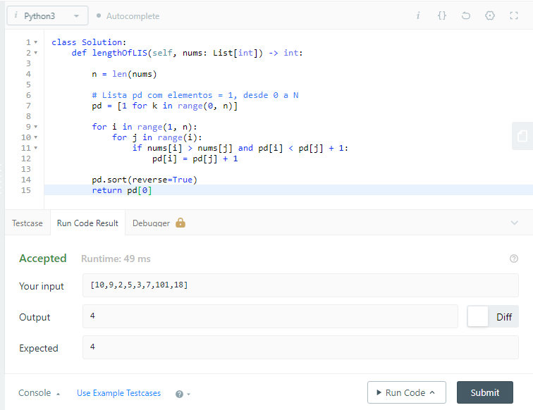
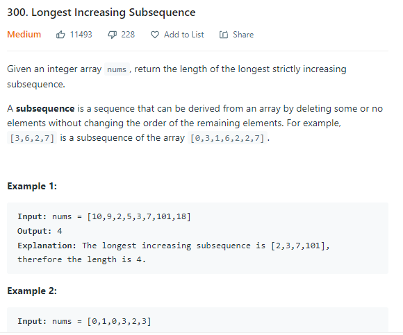

# Dupla 15

**Número da Lista**: 5<br>
**Conteúdo da Disciplina**: PD<br>

## Alunos
|Matrícula | Aluno |
| -- | -- |
| 18/0102656  |  Ítalo Vinícius |
| 18/0145088  |  Gabriel Bonifácio |

## Sobre 

Este repositório tem como foco resolver os seguintes problemas:

- [Maximum Profit in Job Scheduling](https://leetcode.com/problems/maximum-profit-in-job-scheduling/)

- [Longest Increasing Subsequence](https://leetcode.com/problems/longest-increasing-subsequence/)

- [Motoboy](https://www.beecrowd.com.br/judge/pt/problems/view/1286)

- [Bellman-Ford](https://www.codingninjas.com/codestudio/problems/bellmon-ford_2041977?leftPanelTab=0)

## Screenshots

<div align="center">

  

  [Figura 1: Imagem da solução](./images/img1.png)

</div>
  
<div align="center">

  
  
  [Figura 2: Imagem da solução](./images/img2.png)
  
 </div>
  
<div align="center">

  
  
  [Figura 3: Imagem do problema](./images/img3.png)
  
</div>

## Instalação 
**Linguagem**: Python<br>
**Framework**: (caso exista)<br>

Siga as instruções a seguir para rodar o programa:

1) Fazer a instalação do Python, em uma versão superior a 3.6

2) Clonar o repositório.

```sh 
git clone https://github.com/projeto-de-algoritmos/PD_Dupla15.git
```

3) Acessar a pasta da aplicação 

```sh 
cd PD_Dupla15/
```

4) Analisar as soluções dos seguintes arquivos: 

```sh 
Ford-Bellman.py
Longest-Increasing.py
Maximum-Profit.py
Motoboy_1286.py
```

5) Você agora poderá testar as soluções acessando os links que estão no tópico Sobre.

## Uso 
Após avaliar, você poderá verificar se as saídas estão correspondentes às saídas esperadas.

## Outros 
Extraímos as questões do site do [LeetCode](https://leetcode.com/), [Beecrowd](https://www.beecrowd.com.br/) e [CodingNinjas](https://codingninjas.com/).


